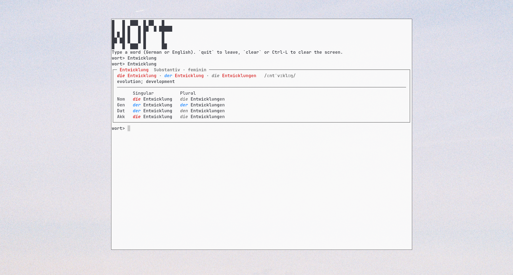

# wort



Self-hosted tool for learning German (EN↔DE). Fully local, works offline on Wiktionary data.

**Status: work in progress.** Only word translation works end to end today.

## Works now

- **Translation (DE → EN).** `wort WORD` returns a compact card: principal forms, translation, IPA, grammar table, up to 10 example sentences.
  - Verbs: Präsens / Präteritum / Perfekt / Futur I, Imperativ.
  - Nouns: 4 cases, singular and plural.
  - Adjectives: comparison degrees.
  - Inflected forms are found too (`ging` → `gehen`).
- **Interactive session.** `wort` opens a prompt: type words or phrases, `/history` shows everything you ever looked up as a bullet list (no duplicates, kept between runs), `/clear-history` deletes it after a confirmation, `clear` wipes the screen, `quit` leaves.
- **Pinned banner and commands.** The WORT banner stays fixed at the top of the terminal and the command list (`/history . /clear-history . clear . quit`) on its last row, while the session scrolls between them. Both follow window resizes. While nothing is on screen, this session's last five words appear as bullets under the banner. Windows under 15 rows get nothing pinned.
- **Several results.** In the session they show as a numbered compact list (forms and translations only). `j`/`k` move, a digit, `l` or Enter opens the full card, `h` goes back, `q`/Esc closes. In an open card `j`/`k` scroll and space/`b` page when it is taller than the screen. Without a terminal everything is printed in full.
- **Phrases.** Several words (up to five, e.g. `warten auf dem`) are looked up as a whole first, otherwise word by word: one result per word in the numbered list, typos corrected per word. The history keeps what you typed.
- **Typos.** When nothing is found, close matches (one or two letters off, a swap counts as one) are offered in the same numbered list under `Did you mean:`. The history keeps what you typed.
- **Query history.** Every lookup is logged automatically to `user.db`.
- **Export.** `wort export` writes history and practice words to JSON (for the future web app).

## Prototype, not finished

Exist in the code (`wort tui`, `wort add`, `wort list`) but are not part of the supported feature set yet:

- Practice exercises (translation, article, forms, multiple choice, sentence)
- SM-2 spaced repetition and mastery scores
- Full-screen TUI (Textual)

## Planned

- **Word memorization**
  - Per-word score and per-skill sub-scores
  - Review scheduling (SM-2)
  - Reliable practice sessions with graded answers
- **Exercises**
  - Translation, article, correct case/form
  - Grammar multiple choice
  - Sentence writing with local LanguageTool check
- **Web view** (FastAPI + Jinja2, SQLite, vanilla JS; UI only from `dis-system`)
  - Progress management: word list, scores, review queue
  - Reading texts: add a text, every word clickable (lemma, translation, grammar note, "learn this word")
  - Text from photo via local OCR (Tesseract)
  - Invite-only multi-user accounts, private network only
- Details: [`PLAN.md`](PLAN.md), rules: [`CLAUDE.md`](CLAUDE.md), decisions: [`DECISIONS.md`](DECISIONS.md)

## Installation

Requires Python ≥ 3.11 and [uv](https://docs.astral.sh/uv/).

```bash
git clone <repo> && cd wort
uv sync
uv run wort import --download     # once: ~1 GB JSONL from kaikki.org → dictionary.db
uv run wort gehen                 # look one word up
```

Already have the dump: `uv run wort import --file kaikki.org-dictionary-German.jsonl`.
Global install: `uv tool install .`

## Commands

| Command | What it does |
|---|---|
| `wort` | interactive session |
| `wort WORD` | look one word up; exit code 1 if not found |
| `wort t WORD` | explicit lookup for words that are also commands (`list`, `add`, …) |
| `wort history [--limit N]` | queries you typed |
| `wort export [FILE]` | history + practice words as JSON |
| `wort import [--file F] [--download] [--keep]` | (re)import the dictionary |
| `wort add WORD [--pos verb]` | *(prototype)* add to practice list |
| `wort list` | *(prototype)* mastery of practice words |
| `wort tui` | *(prototype)* full-screen interface |

## Data and privacy

- Data lives in `~/.local/share/wort/` (or `$XDG_DATA_HOME/wort`, or `$WORT_HOME`): `dictionary.db` (read-only), `user.db` (history, words, SRS state).
- The only network use: `wort import --download` fetches the dump from `kaikki.org`. No API keys, no cloud services.
- Optional LanguageTool client accepts loopback addresses only (`WORT_LT_URL`; remote needs `WORT_LT_ALLOW_REMOTE=1`).

## Development

```bash
uv run pytest
```

```
src/wort/
  cli.py                 # commands, interactive session
  transfer.py            # export format
  dictionary/            # importer, lookup, grammar form selection
  render/card.py         # word card (Rich)
  store.py, srs.py       # user.db, SM-2
  exercises/             # prototype exercises
  tui/                   # Textual interface
tests/fixtures/german_sample.jsonl
```

Dictionary data: [Wiktionary](https://en.wiktionary.org) (CC BY-SA) via [kaikki.org / wiktextract](https://kaikki.org).
